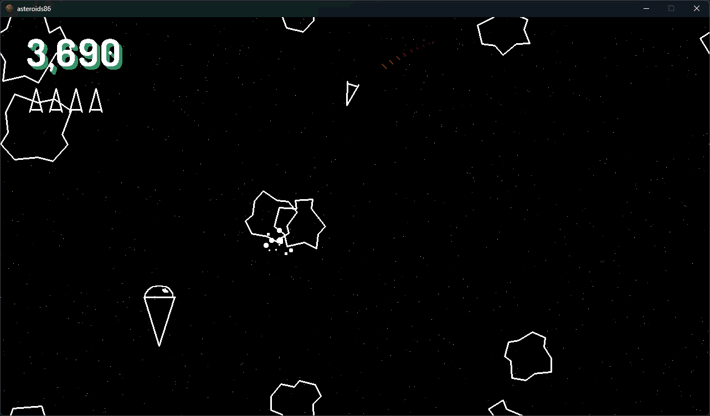

My implementation of the classic Asteroids arcade game, written in pure x86_64 assembly.

The whole game compiles to an executable binary just under __40KB__ in size (on Windows).

If you want to try it out, grab the .exe from the [Releases](https://github.com/taylorplewe/asteroids86/releases) page, or see the [Building](#building) section to build from source!

> [!NOTE]
> This is the `nasm-sdl` branch targeting **multiple operating systems like Linux and macOS.** For the original **Windows** version see the [`main`](https://github.com/taylorplewe/asteroids86/tree/main) branch.

## Controls
Controllers & rumble are supported!
| Action | Keyboard | Controller (Xbox/PlayStation) |
| - | - | - |
| Boost | `w`, Up arrow | RT/R2, D-pad up |
| Fire | `l`, Spacebar | A/Cross, B/Circle |
| Hyperspace | `s`, Down arrow | X/Square, Y/Triangle, D-pad down |
| Turn | `a`/`d`, Left/Right arrow | Left thumbstick, D-pad left, D-pad right |
| Pause | `Esc` | Start |



## Building
> [!IMPORTANT]
> Currently, it depends on and dynamically links to SDL3. I plan on removing this dependency in the future, only calling Win32 functions for creating a window and displaying my pixel buffer, etc.

### Requirements
- [SDL3](https://github.com/libsdl-org/SDL/releases). Make sure `SDL3.lib` can be accessed from your `LIB` environment variable.
- [nasm](https://www.nasm.us) v3.01
- GNU `ld` linker

Make sure `libSDL3.so` is in one of the directories that `ld` looks for libraries; `/lib`, `/usr/lib`, `/usr/local/lib`, etc. I recommend creating a symlink in `/usr/local/lib` that points to your SDL `build` directory. Alternatively, you can just pass the directory `libSDL3.so` is found in with the `-L` flag to `ld`. (e.g. `ld ... -L ~/SDL3/build/`)

Once the above requirements are met, run any one of the following commands in the root directory:
```bash
.\build             # build a debug executable
.\build run         # build and run a debug executable
.\build release     # build an executable with no debug information
.\build release run
.\build res         # compile the resources in the resources directory and build an executable
```

---

### To do
- Remove SDL dependency for Windows
- Port to DOS

### Axed because I had to scale it back
- Invincibility power-up
- Render bullets as a streak instead of a dot
- Make lines glow
- Anti-aliasing
- Sound