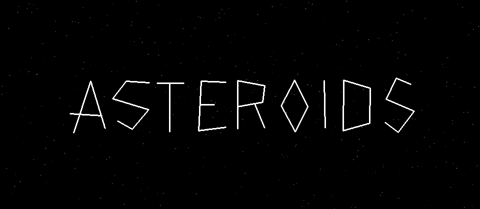

My implementation of the classic Asteroids arcade game, written in pure x86 assembly (the x stands for asteroids)

The whole game compiles to an executable binary just under __40KB__ in size.

> [!NOTE]
> This is the main branch targeting **Windows.** For other operating systems running on x86 like **Mac** or **Linux**, see the [`nasm-sdl`](https://github.com/taylorplewe/asteroids86/tree/nasm-sdl) branch.

## Controls
Controllers & rumble are supported!
| Action | Keyboard | Controller (Xbox/PlayStation) |
| - | - | - |
| Fire | `l`, Spacebar | A/Cross, B/Circle |
| Hyperspace | `s`, Down arrow | X/Square, Y/Triangle |
| Boost | `w`, Up arrow | RT/R2, D-pad up |
| Turn | `a`/`d`, Left/Right arrow | Left thumbstick, D-pad left, D-pad right |
| Pause | `Esc` | Start |

## Building
> [!IMPORTANT]
> Currently, it depends on and dynamically links to SDL3. I plan on removing this dependency in the future, only calling Win32 functions for creating a window and displaying my pixel buffer, etc.

### Requirements
- [SDL3](https://github.com/libsdl-org/SDL/releases). Make sure `SDL3.lib` can be accessed from your `LIB` environment variable.
- MSVC toolchain. See the [docs](https://learn.microsoft.com/en-us/cpp/build/building-on-the-command-line) for how to acquire them. The required binaries are:
  - `ml64.exe`. The 64-bit MASM assembler, which itself invokes the linker afterwards.
  - `link.exe`, the linker.
  - (optional) `rc.exe`, for compiling binary resources in the `resources\` directory. I don't love this method of including binaries and referencing those binaries in the code, but MASM has no `incbin` directive like most assemblers, and this appears to be the recommended method.
- There is only a Powershell build script. If you're not running PowerShell, just look at the build script and run whatever command you need manually.

Once the above requirements are met, run any one of the following commands in the root directory:
```powershell
.\build             # build a debug executable
.\build run         # build and run a debug executable
.\build release     # build an executable with no debug information
.\build release run
.\build res         # compile the resources in the resources directory and build an executable
```

---

### To do
- Remove SDL dependency
- Port to DOS

### Axed because I had to scale it back
- Invincibility power-up
- Render bullets as a streak instead of a dot
- Make lines glow
- Anti-aliasing
- Sound
